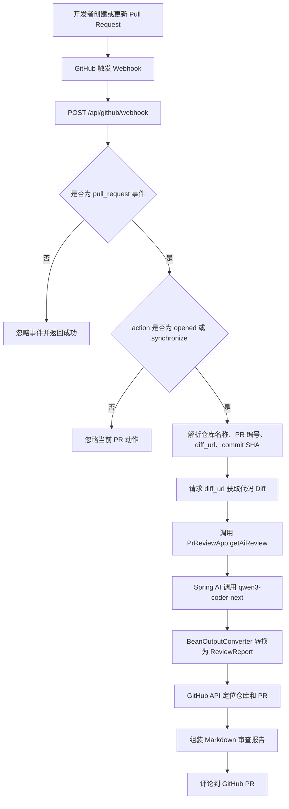

# AI-PR-Review

AI-PR-Review 是一个基于 Spring Boot 的 GitHub Pull Request 智能代码审查服务。项目通过 GitHub Webhook 接收 PR 事件，自动获取本次 PR 的代码 Diff，调用通义千问代码模型生成审查建议，并将审查报告评论回对应的 GitHub Pull Request。

## 功能展示


## 项目特性

- 自动监听 GitHub Pull Request 的 `opened` 和 `synchronize` 事件
- 根据 PR 的 `diff_url` 获取代码变更内容
- 使用 Spring AI Alibaba 接入 DashScope 大模型
- 将 AI 输出转换为结构化审查报告
- 通过 GitHub API 将审查结果写回 PR 评论区
- 集成 Knife4j，便于查看和调试接口文档

## 方法栈

| 模块 | 技术 / 依赖 | 说明 |
| --- | --- | --- |
| 后端框架 | Spring Boot 3.2.12 | 提供 Web 服务、配置管理和依赖注入 |
| AI 能力 | Spring AI Alibaba 1.0.0-M6.1 | 接入 DashScope / 通义千问模型 |
| 默认模型 | `qwen3-coder-next` | 用于分析 PR Diff 并生成代码审查建议 |
| GitHub 集成 | `github-api` 1.318 | 获取仓库和 PR 信息，提交审查评论 |
| 接口文档 | Knife4j 4.4.0 | 提供 OpenAPI 文档页面 |
| 工具库 | Hutool 5.8.37 | 常用 Java 工具能力 |
| 构建工具 | Maven | 项目依赖管理和打包 |
| JDK | Java 21 | 项目编译和运行环境 |

## 执行流程



## 核心代码路径

| 文件 | 作用 |
| --- | --- |
| `src/main/java/com/cxy/aiprreview/controller/GitHubWebhookController.java` | Webhook 入口，过滤 GitHub 事件和 PR 动作 |
| `src/main/java/com/cxy/aiprreview/service/impel/GitHubWebhookServiceImple.java` | 处理 Webhook、获取 Diff、提交 PR 评论 |
| `src/main/java/com/cxy/aiprreview/app/PrReviewApp.java` | 构造 AI 审查提示词，调用大模型并解析结果 |
| `src/main/java/com/cxy/aiprreview/dto/ReviewReport.java` | AI 审查报告结构 |
| `src/main/java/com/cxy/aiprreview/dto/ReviewCommentItem.java` | 单条审查建议结构 |
| `src/main/resources/application.yml` | 服务端口、AI 模型、GitHub Token 等配置 |

## 环境准备

1. 安装 JDK 21
2. 安装 Maven
3. 准备 DashScope API Key
4. 准备 GitHub Token

GitHub Token 需要具备访问目标仓库和评论 Pull Request 的权限。测试阶段可以使用个人 PAT，生产环境更推荐使用 GitHub App。

## 配置说明

项目通过环境变量读取敏感配置：

```bash
AI_DASHSCOPE_API_KEY=你的 DashScope API Key
GITHUB_TOKEN=你的 GitHub Token
```

核心配置位于 `src/main/resources/application.yml`：

```yaml
server:
  port: 8080
  servlet:
    context-path: /api

spring:
  ai:
    dashscope:
      api-key: ${AI_DASHSCOPE_API_KEY}
      chat:
        options:
          model: qwen3-coder-next

github:
  token: ${GITHUB_TOKEN:default_value_if_needed}
```

## 启动项目

```bash
mvn spring-boot:run
```

服务启动后，Webhook 接口地址为：

```text
POST http://localhost:8080/api/github/webhook
```

Knife4j 接口文档地址：

```text
http://localhost:8080/api/doc.html
```

OpenAPI 地址：

```text
http://localhost:8080/api/v3/api-docs
```

## GitHub Webhook 配置

在 GitHub 仓库中进入：

```text
Settings -> Webhooks -> Add webhook
```

推荐配置：

| 配置项 | 值 |
| --- | --- |
| Payload URL | `http://你的公网地址/api/github/webhook` |
| Content type | `application/json` |
| Events | 选择 `Pull requests` |
| Active | 勾选 |

本地调试时，GitHub 无法直接访问 `localhost`，可以使用内网穿透工具将本地 `8080` 端口暴露为公网地址。

## 注意事项

- `AI_DASHSCOPE_API_KEY` 和 `GITHUB_TOKEN` 不要提交到代码仓库。
- Webhook 当前主要处理 `pull_request` 事件中的 `opened` 和 `synchronize` 动作。
- 私有仓库的 `diff_url` 可能需要鉴权访问，需要确保 GitHub Token 权限充足。
- AI 输出依赖模型响应质量，如果返回内容不是合法 JSON，`BeanOutputConverter` 可能解析失败。
- 当前实现将审查结果评论到 PR 主评论区，不是逐行 Review Comment。
- PR Diff 过大时可能触发模型上下文长度限制，建议后续增加 Diff 截断、分文件审查或分批审查能力。
- 建议生产环境增加 Webhook Secret 签名校验，防止非 GitHub 请求伪造调用。
- 建议生产环境使用 GitHub App 替代个人 Token，便于权限隔离和审计。

## 后续优化方向

- 增加 GitHub Webhook 签名校验
- 支持逐行代码评论
- 支持按文件拆分 Diff 并并行审查
- 增加审查等级、风险类型和修复建议分类
- 增加失败重试和审查记录持久化
- 增加单元测试和集成测试覆盖
