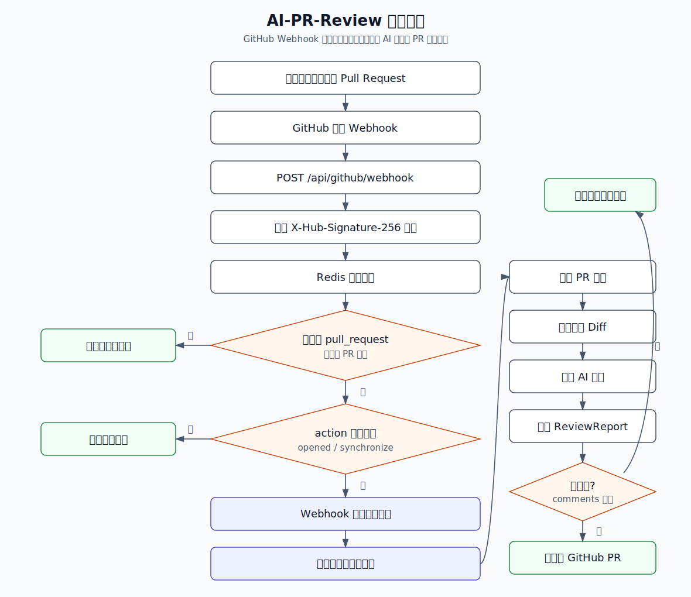

# AI-PR-Review

AI-PR-Review 是一个面向 GitHub Pull Request 的 AI 智能代码审查服务。它通过 GitHub Webhook 接收 PR 事件，校验请求来源，过滤重复投递，异步拉取 PR Diff，调用通义千问代码模型生成结构化审查建议，并把审查报告自动评论回对应的 PR。

## 目录

- [功能展示](#功能展示)
- [核心能力](#核心能力)
- [技术栈](#技术栈)
- [执行流程](#执行流程)
- [项目结构](#项目结构)
- [核心模块说明](#核心模块说明)
- [环境准备](#环境准备)
- [配置说明](#配置说明)
- [本地启动](#本地启动)
- [GitHub Webhook 配置](#github-webhook-配置)
- [测试与验证](#测试与验证)
- [注意事项](#注意事项)
- [后续优化方向](#后续优化方向)

## 功能展示


## 核心能力

- 监听 GitHub Pull Request 的 `opened` 和 `synchronize` 事件。
- 使用 `X-Hub-Signature-256` 校验 Webhook 请求签名，拦截伪造请求。
- 使用 Redis 幂等锁过滤重复 Webhook 投递，避免重复触发 AI 审查和 PR 评论。
- 使用 Spring 异步线程池执行耗时任务，让 Webhook 接口快速响应 GitHub。
- 根据 PR 的 `diff_url` 获取代码变更内容。
- 使用 Spring AI Alibaba 接入 DashScope / 通义千问代码模型。
- 将 AI 返回内容转换为结构化 `ReviewReport`。
- 将审查结果组装成 Markdown，并通过 GitHub API 评论到 PR 主评论区。
- 将 AI 审查提示词外置到资源文件，便于独立维护审查策略。
- 集成 Knife4j / OpenAPI，便于调试接口。

## 技术栈

| 分类 | 技术 / 依赖 | 说明 |
| --- | --- | --- |
| 语言 | Java 21 | 项目编译和运行版本 |
| 后端框架 | Spring Boot 3.2.12 | Web 服务、配置管理、依赖注入 |
| AI 接入 | Spring AI Alibaba 1.0.0-M6.1 | 接入 DashScope 大模型 |
| 默认模型 | `qwen3-coder-next` | 分析 PR Diff 并生成审查建议 |
| GitHub 集成 | `github-api` 1.318 | 获取仓库 / PR 信息，提交 PR 评论 |
| 安全校验 | Spring AOP + HmacSHA256 | 校验 GitHub Webhook 签名 |
| 幂等控制 | Spring Data Redis | 防止重复投递和并发重复处理 |
| 异步处理 | `@Async` + `ThreadPoolTaskExecutor` | 后台执行 AI 审查任务 |
| 接口文档 | Knife4j 4.4.0 | 提供接口文档页面 |
| 工具库 | Hutool 5.8.37 | 常用 Java 工具能力 |
| 构建工具 | Maven | 依赖管理、编译、测试、打包 |

## 执行流程

> 如果当前 Markdown 预览器不支持 Mermaid，也可以直接查看下面的静态流程图。



## 项目结构

```text
AI-PR-Review/
├── image/                                      # README 展示图片和测试截图
├── src/
│   ├── main/
│   │   ├── java/com/cxy/aiprreview/
│   │   │   ├── anno/                          # 自定义注解
│   │   │   ├── aop/                           # Webhook 签名校验、幂等拦截
│   │   │   ├── app/                           # AI 审查应用服务
│   │   │   ├── common/                        # 通用响应封装
│   │   │   ├── config/                        # 异步线程池配置
│   │   │   ├── controller/                    # Webhook 接口
│   │   │   ├── dto/                           # 审查报告数据结构
│   │   │   ├── excption/                      # 业务异常和错误码
│   │   │   ├── filter/                        # 请求体缓存过滤器
│   │   │   ├── service/                       # Webhook 业务服务
│   │   │   └── AiPrReviewApplication.java     # Spring Boot 启动类
│   │   └── resources/
│   │       ├── prompts/pr-review-json-prompt.txt
│   │       ├── application.yml
│   │       └── application-local.yml
│   └── test/
├── pom.xml
└── README.md
```

## 核心模块说明

| 文件 | 作用 |
| --- | --- |
| `GitHubWebhookController.java` | Webhook 入口，过滤事件类型和 PR 动作 |
| `VerifyGitHubSignature.java` | 标记需要进行 GitHub 签名校验的方法 |
| `GitHubSignatureAspect.java` | 基于请求体和 `github.webhook-secret` 计算 HmacSHA256 签名并比对 |
| `RequestCachingFilter.java` | 将请求包装为可重复读取的请求体，支持 AOP 中读取原始 body |
| `Idempotent.java` | 标记需要进行幂等控制的方法，默认锁 5 分钟 |
| `IdempotentAspect.java` | 基于 `X-GitHub-Delivery`、仓库、PR 编号和 commit SHA 生成 Redis 幂等 Key |
| `AsyncConfig.java` | 配置 `aiReviewExecutor`，核心线程 4、最大线程 8、队列容量 50 |
| `GitHubWebhookServiceImple.java` | 异步拉取 Diff、调用 AI、写回 GitHub PR 评论 |
| `PrReviewApp.java` | 加载提示词、调用大模型、将 JSON 转换为 `ReviewReport` |
| `pr-review-json-prompt.txt` | AI 代码审查提示词，约束模型只返回合法 JSON |
| `ReviewReport.java` | AI 审查报告对象，包含多条评论 |
| `ReviewCommentItem.java` | 单条审查建议，包含文件路径、行号、建议和修复代码片段 |

## 环境准备

本地运行前需要准备：

1. JDK 21
2. Maven 3.8+
3. Redis 服务
4. DashScope API Key
5. GitHub Token
6. GitHub Webhook Secret
7. 一个可被 GitHub 访问的公网地址，本地调试可使用内网穿透工具

GitHub Token 需要具备访问目标仓库和评论 Pull Request 的权限。测试阶段可以使用个人 PAT，生产环境更推荐使用 GitHub App。

## 配置说明

项目主配置位于 `src/main/resources/application.yml`。当前启用了 `local` profile，因此本地会额外读取 `src/main/resources/application-local.yml`。

敏感信息建议通过环境变量或本地私有配置注入，不要提交真实密钥、Token、Redis 密码到仓库。

推荐环境变量：

| 变量 | 是否必需 | 说明 |
| --- | --- | --- |
| `AI_DASHSCOPE_API_KEY` | 是 | DashScope API Key，用于调用通义千问模型 |
| `GITHUB_TOKEN` | 是 | GitHub API Token，用于访问仓库和评论 PR |
| `GITHUB_WEBHOOK_SECRET` | 是 | GitHub Webhook Secret，用于签名校验 |
| `REDIS_HOST` | 是 | Redis 地址 |
| `REDIS_PORT` | 否 | Redis 端口，默认通常为 `6379` |
| `REDIS_PASSWORD` | 视环境而定 | Redis 密码 |

示例配置：

```yaml
spring:
  ai:
    dashscope:
      api-key: ${AI_DASHSCOPE_API_KEY}
      chat:
        options:
          model: qwen3-coder-next
  data:
    redis:
      host: ${REDIS_HOST}
      port: ${REDIS_PORT:6379}
      password: ${REDIS_PASSWORD:}
      database: 2

github:
  token: ${GITHUB_TOKEN}
  webhook-secret: ${GITHUB_WEBHOOK_SECRET}
```

> 当前 `application.yml` 只显式配置了 Redis 的 `database: 2`，如果不使用 `application-local.yml`，请补充 Redis 连接地址、GitHub Token 和 Webhook Secret。

## 本地启动

安装依赖并运行测试：

```bash
mvn test
```

启动服务：

```bash
mvn spring-boot:run
```

服务默认地址：

```text
http://localhost:8080/api
```

Webhook 接口：

```text
POST http://localhost:8080/api/github/webhook
```

Knife4j 文档地址：

```text
http://localhost:8080/api/doc.html
```

OpenAPI 地址：

```text
http://localhost:8080/api/v3/api-docs
```

## GitHub Webhook 配置

进入 GitHub 仓库：

```text
Settings -> Webhooks -> Add webhook
```

推荐配置：

| 配置项 | 推荐值 |
| --- | --- |
| Payload URL | `http://你的公网地址/api/github/webhook` |
| Content type | `application/json` |
| Secret | 与 `github.webhook-secret` 保持一致 |
| Events | 选择 `Pull requests` |
| Active | 勾选 |

GitHub 触发请求时会携带：

| Header | 说明 |
| --- | --- |
| `X-GitHub-Event` | 事件类型，本项目只处理 `pull_request` |
| `X-GitHub-Delivery` | 本次投递的唯一 ID，用于幂等 Key |
| `X-Hub-Signature-256` | 基于请求体和 Secret 生成的 `sha256=` 签名 |

## 测试与验证

### 签名校验

签名校验会使用请求原始 body 和 `github.webhook-secret` 计算 HmacSHA256。缺少签名或签名不匹配时，请求会被拒绝。


### 重复请求过滤

幂等逻辑会组合 `X-GitHub-Delivery`、仓库名、PR 编号和 commit SHA 生成 Redis Key。默认 5 分钟内相同请求只会处理一次。


### 异步审查

合法 Webhook 会先快速返回成功，AI 审查、Diff 拉取和 GitHub 评论写回由后台线程池继续执行。


## 注意事项

- 不要把 DashScope API Key、GitHub Token、Webhook Secret、Redis 密码提交到代码仓库。
- 当前代码依赖 `github.webhook-secret`，缺少该配置会导致服务启动或签名校验失败。
- 当前代码使用 Redis 做幂等控制，Redis 不可用会影响 Webhook 正常处理。
- Webhook 当前只处理 `pull_request` 事件中的 `opened` 和 `synchronize` 动作。
- Webhook 返回成功只代表请求已进入处理流程，不代表 AI 审查已经完成。
- 私有仓库的 `diff_url` 可能需要鉴权访问，当前拉取 Diff 使用 `RestTemplate` 直接请求，需要根据私有仓库场景补充鉴权。
- AI 输出依赖模型响应质量，如果返回内容不是合法 JSON，`BeanOutputConverter` 可能解析失败。
- 当前实现将审查结果发布到 PR 主评论区，不是逐行 Review Comment。
- PR Diff 过大时可能触发模型上下文长度限制，建议后续按文件拆分或分批审查。
- 当前 `RestTemplate` 未显式配置连接和读取超时，生产环境建议补充超时、重试和降级策略。

## 后续优化方向

- 支持逐行 Review Comment，直接定位到具体文件行。
- 支持私有仓库 Diff 拉取鉴权。
- 支持按文件拆分 Diff 并分批调用 AI。
- 增加 AI 返回 JSON 的容错修复和重试策略。
- 增加审查结果持久化，便于追踪历史 PR 质量。
- 增加 GitHub App 接入，替代个人 PAT。
- 增加 Dockerfile / docker-compose，简化部署和本地联调。
- 增加更多单元测试和端到端 Webhook 测试。
