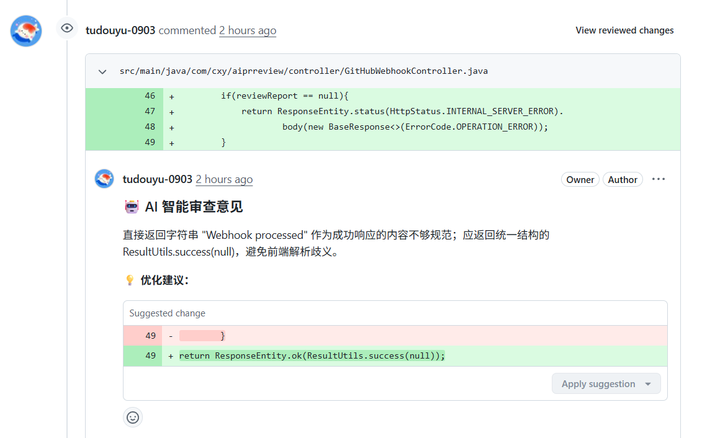
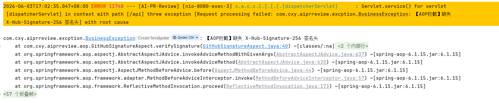
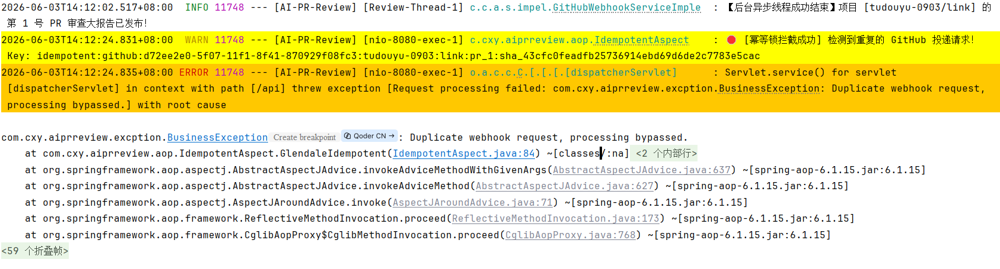
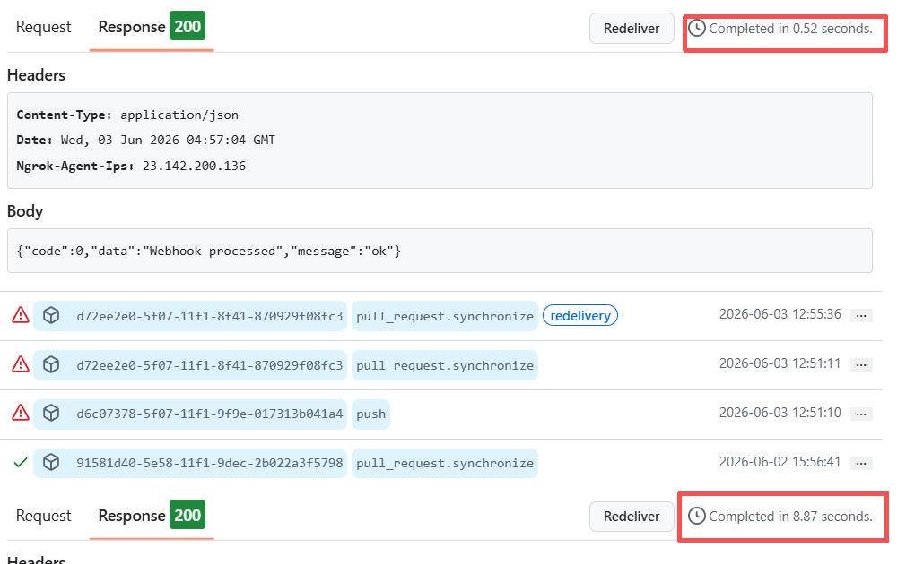
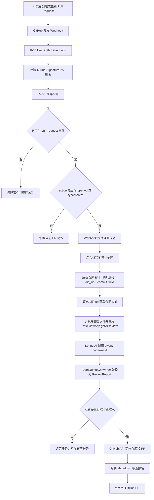

# AI-PR-Review

AI-PR-Review 是一个基于 Spring Boot 的 GitHub Pull Request 智能代码审查服务。项目通过 GitHub Webhook 接收 PR 事件，自动获取本次 PR 的代码 Diff，调用通义千问代码模型生成审查建议，并将审查报告评论回对应的 GitHub Pull Request。

## 功能展示



## 优化说明与测试结果

本项目近期围绕 Webhook 安全性、请求幂等性、响应速度和 AI 审查质量进行了四项重点优化：

### 1. GitHub Webhook 签名校验

新增 `@VerifyGitHubSignature` 注解和 AOP 校验逻辑，通过 `X-Hub-Signature-256` 请求头与 `github.webhook-secret` 计算出的 HmacSHA256 签名进行比对。签名缺失或不匹配时会直接拦截请求，避免非 GitHub 来源伪造 Webhook 调用。

签名校验已使用 Apifox 模拟请求进行测试，验证了非法签名无法进入业务处理流程。



### 2. 并发重复请求优化

新增 `@Idempotent` 注解和 Redis 幂等拦截逻辑，根据 `X-GitHub-Delivery`、仓库名、PR 编号和最新 commit SHA 组合生成幂等 Key。相同 Webhook 投递在有效期内只允许处理一次，避免 GitHub 重复投递或并发请求导致 AI 重复审查、PR 重复评论。



### 3. 异步优化 AI 回复

Webhook 接口收到合法请求后会快速返回成功，AI 审查、Diff 拉取和 GitHub 评论写回交给后台线程池 `aiReviewExecutor` 异步执行。这样可以降低 GitHub Webhook 超时风险，也让接口响应更加稳定。



### 4. 提示词优化

将 AI 审查提示词从 Java 代码中抽离到 `src/main/resources/prompts/pr-review-json-prompt.txt`，并强化了审查约束：

- 只审查本次 Diff 中新增或修改的代码
- 优先输出真实 bug、安全风险、可靠性问题和可维护性问题
- 减少泛泛的风格建议和重复建议
- 要求模型只返回合法 JSON，便于转换为 `ReviewReport`
- 没有明确问题时返回空 `comments` 数组，避免无意义 PR 评论

## 项目特性

- 自动监听 GitHub Pull Request 的 `opened` 和 `synchronize` 事件
- 基于 `X-Hub-Signature-256` 校验 GitHub Webhook 请求签名
- 基于 Redis 幂等 Key 过滤重复 Webhook 投递和并发重复请求
- 使用后台线程池异步执行 AI 审查，Webhook 接口可快速响应
- 根据 PR 的 `diff_url` 获取代码变更内容
- 使用 Spring AI Alibaba 接入 DashScope 大模型
- 支持外置提示词文件，便于独立维护 AI 审查策略
- 将 AI 输出转换为结构化审查报告
- 通过 GitHub API 将审查结果写回 PR 评论区
- 集成 Knife4j，便于查看和调试接口文档

## 技术栈

| 模块 | 技术 / 依赖 | 说明 |
| --- | --- | --- |
| 后端框架 | Spring Boot 3.2.12 | 提供 Web 服务、配置管理和依赖注入 |
| AI 能力 | Spring AI Alibaba 1.0.0-M6.1 | 接入 DashScope / 通义千问模型 |
| 默认模型 | `qwen3-coder-next` | 用于分析 PR Diff 并生成代码审查建议 |
| GitHub 集成 | `github-api` 1.318 | 获取仓库和 PR 信息，提交审查评论 |
| 安全校验 | Spring AOP + HmacSHA256 | 校验 GitHub Webhook 签名，拦截非法请求 |
| 幂等控制 | Spring Data Redis | 过滤重复投递，避免重复触发 AI 审查 |
| 异步处理 | Spring `@Async` + `ThreadPoolTaskExecutor` | 后台执行耗时 AI 审查任务 |
| 接口文档 | Knife4j 4.4.0 | 提供 OpenAPI 文档页面 |
| 工具库 | Hutool 5.8.37 | 常用 Java 工具能力 |
| 构建工具 | Maven | 项目依赖管理和打包 |
| JDK | Java 21 | 项目编译和运行环境 |

## 执行流程



## 核心代码路径

| 文件 | 作用 |
| --- | --- |
| `src/main/java/com/cxy/aiprreview/controller/GitHubWebhookController.java` | Webhook 入口，过滤 GitHub 事件和 PR 动作 |
| `src/main/java/com/cxy/aiprreview/service/impel/GitHubWebhookServiceImple.java` | 处理 Webhook、获取 Diff、提交 PR 评论 |
| `src/main/java/com/cxy/aiprreview/app/PrReviewApp.java` | 读取提示词文件，调用大模型并解析结果 |
| `src/main/resources/prompts/pr-review-json-prompt.txt` | AI 代码审查提示词 |
| `src/main/java/com/cxy/aiprreview/aop/GitHubSignatureAspect.java` | GitHub Webhook 签名校验 |
| `src/main/java/com/cxy/aiprreview/aop/IdempotentAspect.java` | Webhook 幂等控制，防止重复处理 |
| `src/main/java/com/cxy/aiprreview/config/AsyncConfig.java` | AI 审查异步线程池配置 |
| `src/main/java/com/cxy/aiprreview/filter/RequestCachingFilter.java` | 缓存请求体，支持签名校验重复读取 body |
| `src/main/java/com/cxy/aiprreview/dto/ReviewReport.java` | AI 审查报告结构 |
| `src/main/java/com/cxy/aiprreview/dto/ReviewCommentItem.java` | 单条审查建议结构 |
| `src/main/resources/application.yml` | 服务端口、AI 模型、GitHub Token 等配置 |

## 环境准备

1. 安装 JDK 21
2. 安装 Maven
3. 准备 DashScope API Key
4. 准备 GitHub Token
5. 准备 Redis 服务，用于 Webhook 幂等控制
6. 准备 GitHub Webhook Secret，用于签名校验

GitHub Token 需要具备访问目标仓库和评论 Pull Request 的权限。测试阶段可以使用个人 PAT，生产环境更推荐使用 GitHub App。

## 配置说明

项目通过环境变量读取敏感配置：

```bash
AI_DASHSCOPE_API_KEY=你的 DashScope API Key
GITHUB_TOKEN=你的 GitHub Token
GITHUB_WEBHOOK_SECRET=你的 GitHub Webhook Secret
REDIS_HOST=你的 Redis 地址
REDIS_PORT=6379
REDIS_PASSWORD=你的 Redis 密码
```

核心配置位于 `src/main/resources/application.yml`：

```yaml
server:
  port: 8080
  servlet:
    context-path: /api

spring:
  ai:
    dashscope:
      api-key: ${AI_DASHSCOPE_API_KEY}
      chat:
        options:
          model: qwen3-coder-next
  data:
    redis:
      host: ${REDIS_HOST}
      port: ${REDIS_PORT:6379}
      password: ${REDIS_PASSWORD}
      database: 2

github:
  token: ${GITHUB_TOKEN:default_value_if_needed}
  webhook-secret: ${GITHUB_WEBHOOK_SECRET}
```

## 启动项目

```bash
mvn spring-boot:run
```

服务启动后，Webhook 接口地址为：

```text
POST http://localhost:8080/api/github/webhook
```

Knife4j 接口文档地址：

```text
http://localhost:8080/api/doc.html
```

OpenAPI 地址：

```text
http://localhost:8080/api/v3/api-docs
```

## GitHub Webhook 配置

在 GitHub 仓库中进入：

```text
Settings -> Webhooks -> Add webhook
```

推荐配置：

| 配置项 | 值 |
| --- | --- |
| Payload URL | `http://你的公网地址/api/github/webhook` |
| Content type | `application/json` |
| Secret | 与 `github.webhook-secret` 保持一致 |
| Events | 选择 `Pull requests` |
| Active | 勾选 |

本地调试时，GitHub 无法直接访问 `localhost`，可以使用内网穿透工具将本地 `8080` 端口暴露为公网地址。

如果使用 Apifox 测试签名校验，需要根据请求体和 Webhook Secret 计算 `sha256=` 开头的 HmacSHA256 签名，并放入 `X-Hub-Signature-256` 请求头。

## 注意事项

- `AI_DASHSCOPE_API_KEY` 和 `GITHUB_TOKEN` 不要提交到代码仓库。
- `GITHUB_WEBHOOK_SECRET`、Redis 密码等敏感配置同样不要提交到代码仓库。
- Webhook 当前主要处理 `pull_request` 事件中的 `opened` 和 `synchronize` 动作。
- Webhook 请求必须携带合法的 `X-Hub-Signature-256` 签名，否则会被拦截。
- 重复投递会被 Redis 幂等逻辑拦截，默认锁有效期为 5 分钟。
- AI 审查已改为异步执行，接口返回成功只代表请求已进入处理流程，不代表 AI 评论已经立即发布完成。
- 私有仓库的 `diff_url` 可能需要鉴权访问，需要确保 GitHub Token 权限充足。
- AI 输出依赖模型响应质量，如果返回内容不是合法 JSON，`BeanOutputConverter` 可能解析失败。
- 当前实现将审查结果评论到 PR 主评论区，不是逐行 Review Comment。
- PR Diff 过大时可能触发模型上下文长度限制，建议后续增加 Diff 截断、分文件审查或分批审查能力。
- 建议生产环境使用 GitHub App 替代个人 Token，便于权限隔离和审计。

